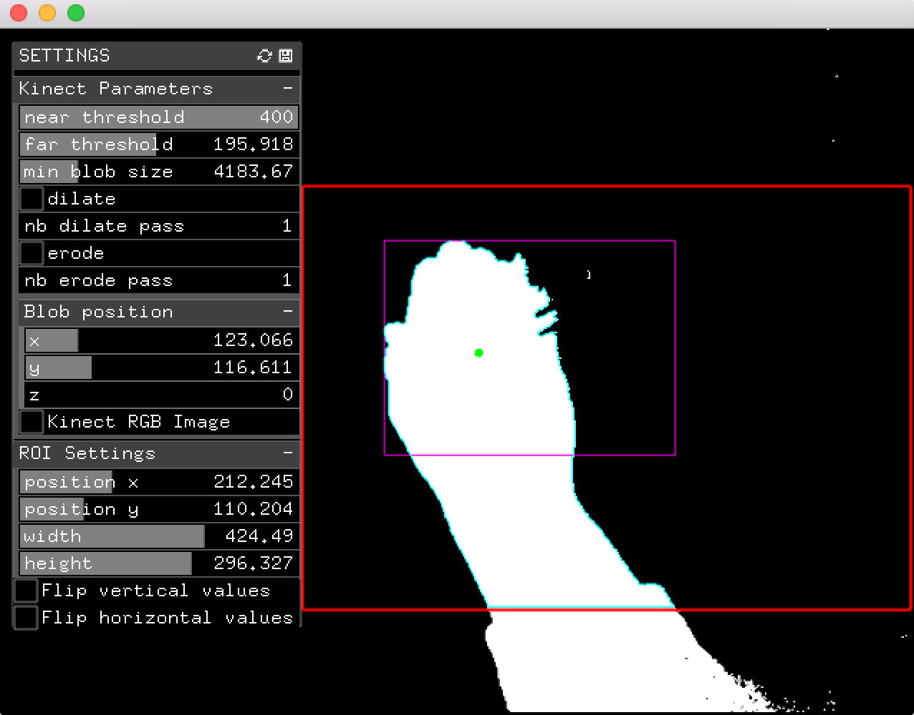

ofOscKinect
===========

Kinect user interface that sends OSC commands relative to openCV detected blobs.
Possible to use of region of interest (ROI) to limit detection area and dilate and erode filters to optimaize blob shape.

Developped with openFrameworks 0.9.3 under MacOSX El Capitan and XCode 7.1

Core oF addons :
- ofxKinect
- ofxOpenCv
- ofxXmlSettings
- ofxOsc
- ofxGui

TODO
-------

- add record / play depth image function to use it as « away from kinect » debugging sample

License
-------

ofOscKinect - Graphical user interface for Kinect and CV detection with OSC features

Martial GALLORINI (http://martialgallorini.github.io/)

This program is free software: you can redistribute it and/or modify
it under the terms of the GNU General Public License as published by
the Free Software Foundation, either version 3 of the License, or
(at your option) any later version.

This program is distributed in the hope that it will be useful,
but WITHOUT ANY WARRANTY; without even the implied warranty of
MERCHANTABILITY or FITNESS FOR A PARTICULAR PURPOSE. See the
GNU General Public License for more details.

You should have received a copy of the GNU General Public License
along with this program.  If not, see <http://www.gnu.org/licenses/>.

